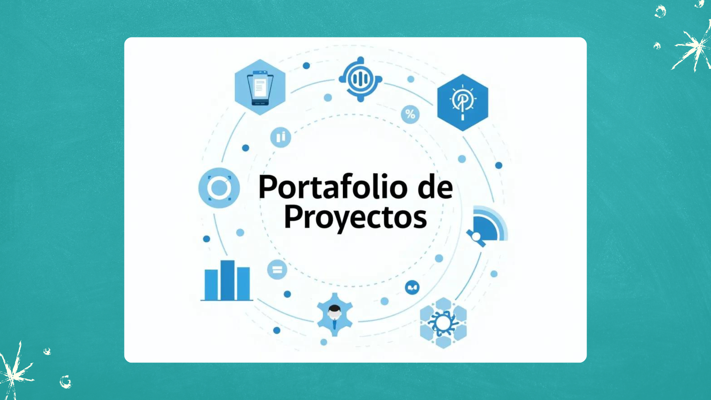

En este portafolio, podrán explorar una variedad de proyectos que reflejan mi experiencia y habilidades en el campo de la ciencia de datos. He trabajado en diversas aplicaciones de Machine Learning y análisis de datos, desde la construcción de modelos predictivos hasta la implementación de soluciones analíticas avanzadas. Cada proyecto incluye una descripción detallada del problema abordado, la metodología empleada y los resultados obtenidos. Mi objetivo es mostrar cómo he utilizado herramientas y técnicas avanzadas para resolver problemas reales y generar insights valiosos.

## Listado de Proyectos:

### - Análisis Exploratorio de Datos:

**Análisis Exploratorio de Datos Automatizado:** [EDAutomated](https://github.com/Cheski1610/EDAutomated.git)
**Análisis Exploratorio sobre Informe Mundial de Felicidad (Python):** [EDA Informe Felicidad Mundial](./EDA - Informe Mundial de Felicidad (Python)) 
**Análisis Exploratorio sobre Airbnb Milan 2019 (R):** [EDA Airbnb Milan 2019](./EDA - Airbnb Milan 2019 (R))

### - Análisis Geoespacial:

**Mapa Cantonal de Costa Rica:** [MapaCantonalCR](https://github.com/Cheski1610/mapacantonalcr.git)

### - Aplicaciones Web de Datos:

**App Modelos Predicción de Cargos por Seguros:** [AppPycaret](https://github.com/Cheski1610/AppPycaret.git)
